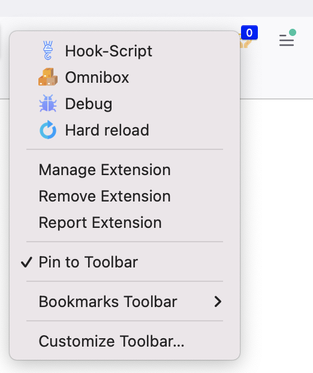
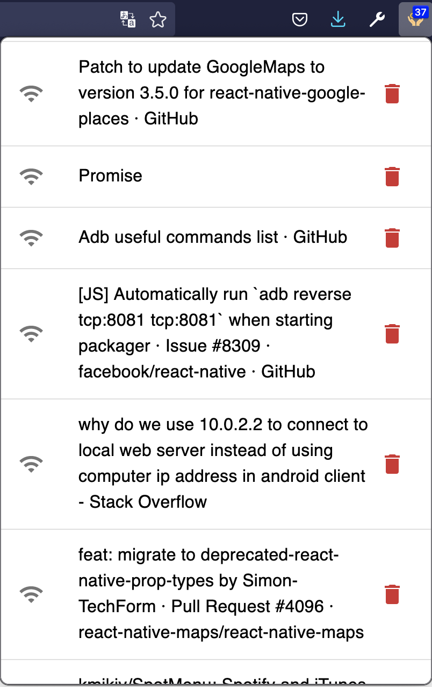
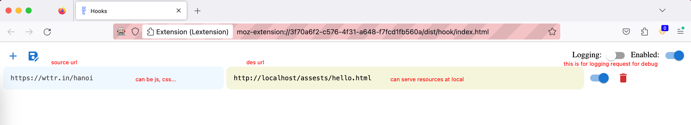
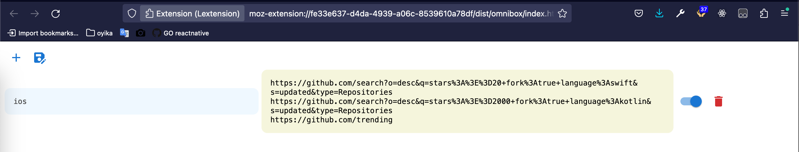

# LExtension
LExtension includes several tools to surf web with ease ✌️

## Usage

- install dependencies: `yarn`
- run web-ext: `yarn dev`
- release extension: `yarn release`

## Features

### Readlater
I'm now ~~lazy~~ busy, save this tab for later read!
- `ctrl + b` to save hightlighted tabs.
- 
 

### Hook
I want to modify this js file 🔁
- redirect `src` to `des` urls
- 

 

### Omnibox
Fast open stuffs
- type this: `ee ios`
- 
## Credits
Thanks
- [flaticon](https://www.flaticon.com/)  for providing beautiful icons.
- [sponsorblock](https://github.com/ajayyy/SponsorBlock)  for developing an awesome extension for usability and reference.
